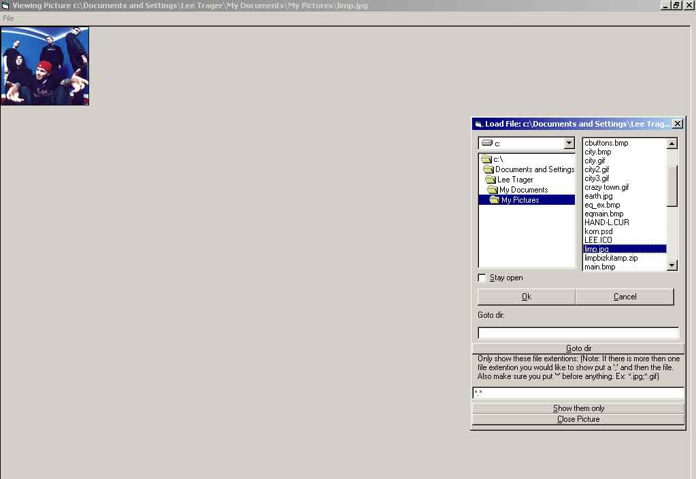



## Open, Print Pictures Fast\!

### Description

Do have about alot of pictures you want to view fast? This will do it! It has its own open thing, so all u have to do is double click on an image and it will open. It will keep the open box open so you can keep load. Then you can print you picture.
 
### More Info
 

             |
---                |---
**Submitted On**   |2001-05-16 16:57:38
**By**             |[Lee Trager](https://github.com/Planet-Source-Code/PSCIndex/blob/master/ByAuthor/lee-trager.md)
**Level**          |Beginner
**User Rating**    |3.5 (14 globes from 4 users)
**Compatibility**  |VB 6\.0
**Category**       |[Graphics](https://github.com/Planet-Source-Code/PSCIndex/blob/master/ByCategory/graphics__1-46.md)
**World**          |[Visual Basic](https://github.com/Planet-Source-Code/PSCIndex/blob/master/ByWorld/visual-basic.md)
**Archive File**   |[Open, Prin197175172001\.zip](https://github.com/Planet-Source-Code/lee-trager-open-print-pictures-fast__1-23238/archive/master.zip)

